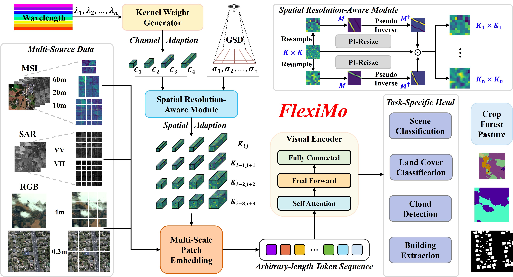

<div align="center">
<h1>FlexiMo: A Flexible Remote Sensing Foundation Model 🌍🛰️
</h1>
  
This is the official repository for the paper 
"_FlexiMo: A Flexible Remote Sensing Foundation Model_".  

**IEEE TGRS: ([https://ieeexplore.ieee.org/document/11359569](https://ieeexplore.ieee.org/document/11359569))

Xuyang Li, Chenyu Li, Pedram Ghamisi, [Danfeng Hong](https://scholar.google.com/citations?hl=en&user=n7gL0_IAAAAJ&view_op=list_works&sortby=pubdate), [Jon Atli Benediktsson](https://scholar.google.com/citations?user=C6d7qe0AAAAJ&hl=en), [Jocelyn Chanussot](https://scholar.google.com/citations?user=6owK2OQAAAAJ&hl=en)
</div>

## 📄 Abstract

The rapid expansion of multi-source satellite imagery drives innovation in Earth observation, opening unprecedented opportunities for Remote Sensing Foundation Models to harness diverse data. However, many existing models remain constrained by fixed spatial resolutions and patch sizes, limiting their ability to fully exploit the heterogeneous spatial characteristics inherent in satellite imagery. To address these challenges, we propose **FlexiMo**, a flexible remote sensing foundation model that endows the pre-trained model with the flexibility to adapt to arbitrary spatial resolutions. Central to FlexiMo is a spatial resolution-aware module that employs a parameter-free alignment embedding mechanism to dynamically recalibrate patch embeddings based on the input image's resolution and dimensions. This design not only preserves critical token characteristics and ensures multi-scale feature fidelity but also enables efficient feature extraction without requiring modifications to the underlying network architecture. In addition, FlexiMo incorporates a lightweight channel adaptation module that leverages prior spectral information from sensors. This mechanism allows the model to process images with varying numbers of channels while maintaining the data's intrinsic physical properties. Extensive experiments on diverse multimodal, multi-resolution, and multi-scale datasets demonstrate that FlexiMo significantly enhances model generalization and robustness. In particular, our method achieves outstanding performance across a range of downstream tasks, including scene classification, land cover classification, urban building segmentation, and cloud detection. By enabling parameter-efficient and physically consistent adaptation, FlexiMo paves the way for more adaptable and effective foundation models in real-world remote sensing applications.

---

## 👀 Overview



---

## 🛠️ Preparation

Install Python dependencies by running:

```bash
pip install -r requirements.txt
```

---

## 🚀 Training FlexiMo

The training experiments were conducted on four NVIDIA GeForce RTX 4090 GPUs. The pretrained model we use is DOFA, which can be downloaded 🤗[here](https://huggingface.co/earthflow/DOFA/tree/main).

### Dataset: EuroSAT-MS, EuroSAT-SAR, SegMunich, WHU-Building, GF12MS-WHU
Below is a summary table listing the official download links for datasets used to fine-tune our pretrained model across various tasks, including spectral scene classification, SAR scene classification, land cover classification, urban building extraction, and cloud detection.
| Dataset       | Download Link                                                                                                        | Task Description                                     |
|---------------|----------------------------------------------------------------------------------------------------------------------|------------------------------------------------------|
| EuroSAT-MS    | [Download](https://github.com/phelber/EuroSAT#eurosat-land-use-and-land-cover-classification-with-sentinel-2)        | Spectral Scene Classification Tasks            |
| EuroSAT-SAR   | [Download](https://huggingface.co/datasets/wangyi111/EuroSAT-SAR/tree/main)                                          | SAR Scene Classification Tasks                       |
| SegMunich     | [Download](https://huggingface.co/datasets/Moonboy12138/SegMunich/blob/main/TUM_128.zip)                             | Land Cover Classification Tasks                      |
| WHU-Building  | [Download](http://gpcv.whu.edu.cn/data/building_dataset.html)                                                        | Urban Building Extraction Tasks                      |
| GF12MS-WHU    | [Download](https://github.com/whu-ZSC/GF1-GF2MS-WHU)                                                                 | Cloud Detection Tasks                                |

---

## 📚 Usage

You can adjust the `resize` model parameter to automatically resize the patch embedding to any size corresponding to the resolution! Below is an example; a demo is also provided [here](./src/fleximo/models_dwv.py).

```python
import torch

checkpoint_model = torch.load('pretrained_checkpoint.pth', weights_only=True)
resize_patch_size = 32
vit_model = vit_base_patch16(resize=resize_patch_size)
state_dict = vit_model.state_dict()
msg = vit_model.load_state_dict(checkpoint_model, strict=False)
print(msg)
vit_model = vit_model.cuda()
s2_img = torch.randn(10, 12, 112, 112).cuda()
wavelengths = [0.443, 0.490, 0.560, 0.665, 0.705, 0.740, 0.783, 0.842, 0.865, 0.940, 1.61, 2.19]
out_feat = vit_model.forward_features(s2_img, wave_list=wavelengths)
out_logits = vit_model.forward(s2_img, wave_list=wavelengths)
print(out_feat.shape)
print(out_logits.shape)
```

---

## 🖼️ Image-level Tasks

We provide code to load the pretrained model and use FlexiMo for image-level tasks [here](./src/fleximo/models_dwv.py). For training and inference code, refer to [SpectralGPT](https://github.com/danfenghong/IEEE_TPAMI_SpectralGPT).

---

## 🌍 Pixel-level Tasks

We provide code to load the pretrained model and use FlexiMo for pixel-level tasks [here](./src/pixel_tasks). For training and inference code, refer to [SegMunich](https://github.com/danfenghong/IEEE_TPAMI_SpectralGPT/tree/main/downstream_tasks/SegMunich). These codes are easy to use when paired with the correct data and checkpoint paths.

To fine-tune on the SegMunich dataset, use the following command:

```bash
python -m torch.distributed.launch --nproc_per_node=2 \
--master_port=25643 --use_env train_multi_GPU_new.py
```

---

## 🙏 Acknowledgements

Pretrain and downstream classification codes are inspired by [MAE](https://github.com/facebookresearch/mae) and [DOFA](https://github.com/zhu-xlab/DOFA/tree/master). Downstream pixel-level codes are inspired by [Seasonal Contrast (SeCo)](https://github.com/danfenghong/IEEE_TPAMI_SpectralGPT) and [SpectralGPT](https://github.com/danfenghong/IEEE_TPAMI_SpectralGPT).

---

## 📝 Citation

If you find our project helpful, please cite our paper:

```bibtex
@article{li2026fleximo,
  title={Fleximo: A flexible remote sensing foundation model},
  author={Li, Xuyang and Li, Chenyu and Ghamisi, Pedram and Hong, Danfeng and Benediktsson, Jon Atli and Chanussot, Jocelyn},
  journal={IEEE Transactions on Geoscience and Remote Sensing},
  year={2026}
}
```

---

## 📜 Licensing

Copyright © 2026 Danfeng Hong

This program is free software: you can redistribute it and/or modify it under the terms of the GNU General Public License as published by the Free Software Foundation, version 3.

---

## 📧 Contact Information

**Danfeng Hong**: hongdanfeng1989@gmail.com  
School of Automation, Southeast University, 211189 Nanjing, China.

---
